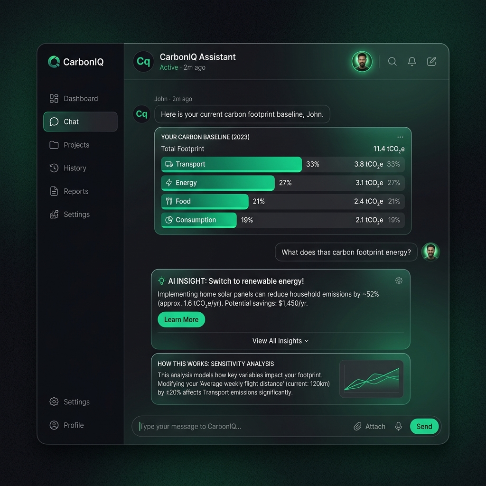

# CarbonIQ — Carbon Footprint Assistant

**Analyze. Optimize. Reduce.** CarbonIQ is a carbon-awareness decision assistant that helps users understand, track, and reduce their carbon footprint through real-time trip comparisons (Decision Mode) and a full lifestyle audit (Baseline Mode), powered by an explainable sensitivity analysis engine.

## Chosen Vertical
* **[Challenge 3] Carbon Footprint Awareness Platform** (Google Virtual Promptwars)

---

## The Problem with Typical Solutions

Most carbon footprint platforms follow a stagnant pattern:
1. Answer a long, tedious questionnaire.
2. Get a static footprint score.
3. Receive generic, unengaging tips (e.g. "turn off the lights").

Users rarely return because these platforms fail to address **in-the-moment decision making** and present calculations as a **black box** without explaining which choices actually drive the numbers.

CarbonIQ solves this by centering on **Decision Mode** (comparing real-time transportation choices) and making calculations transparent with a **"Why this number?" sensitivity analysis panel** for every estimate.

---

## Approach & Logic

CarbonIQ is structured as a single-thread chat assistant. Every interaction (form, questionnaire, chart, recommendation) is rendered chronologically in a conversational layout.

### Architectural Core

* **Decision Mode:** Allows users to input travel distance and select modes (e.g., petrol car, electric car, bus, train, metro, flight). It uses precise emission factors to compare choices, show carbon savings, and translate savings into intuitive equivalences (e.g., phone charges).
* **Baseline Mode:** Guides the user through a quick 8-question audit of their lifestyle. It returns visual ranked category bars, benchmarks the grand total against global averages, and prioritized top actions.
* **Explainability Layer:** Runs sensitivity analysis on calculation inputs. By perturbing numeric factors by +10%, it calculates the percentage shift in output to reveal the primary driver of the user's emissions.
* **Gemini Advisor Routing:** Synthesizes footprint data and recommendations using Gemini API (`gemini-2.0-flash`) with strict constraints to prevent hallucination. If no API key is provided, the platform degrades gracefully to a robust rule-based templating advisor.

### Architecture Diagram

```
               [ React Chat UI (Vite) ]
               /                      \
        (Decision Mode)            (Baseline Mode)
             /                          \
  [ api.compareDecision() ]    [ api.calculate() & api.getAdvice() ]
             |                          |
    [ server/routes/decision ]   [ server/routes/calculate / advice ]
             |                          |
             +------------+-------------+
                          |
             [ Node.js/Express Server ]
             /            |           \
 [ Engine: calculator ]   |     [ Engine: comparator ]
 [ Engine: explainer  ]   |     [ Engine: recommender ]
             \            |           /
              +-----------+----------+
                          |
               [ data/emissionFactors ]
               [ data/equivalences    ]
               [ data/sessions.json   ]
```

---

## How the Solution Works

1. **User Identity:** The user enters a short name/identifier. If history is found, the assistant recalls their last committed decision or baseline.
2. **Path Selection:** The user selects to compare trip options or audit their carbon profile.
3. **Trip Comparison Flow:**
   - Input trip distance and select options.
   - The comparison displays best/worst modes, potential savings, and equivalent smartphone charges.
   - Click "Why this number?" to run sensitivity analysis showing how distance shifts the emissions.
   - User commits to the green choice (persisted to `sessions.json`).
4. **Lifestyle Audit Flow:**
   - Answer commuter, flying, household energy, dietary, and shopping questions.
   - The results render a ranked category chart and global benchmark comparisons (e.g., US, India, Paris Agreement target).
   - Click "Explain" next to any category to perform sensitivity analysis on that category's parameters.
   - The platform delivers personalized advisor feedback (AI-enhanced if Gemini is configured) and a "What-If" simulator slider to tweak commute distance in real-time.

---

## Data Sources & Assumptions

* **Emission Factors:** Values compiled from the EPA, IPCC, and *Our World in Data* global averages for educational/awareness purposes.
* **Equivalences:** Calculations for smartphone charges (based on EPA greenhouse gas equivalences) and tree monthly absorption rates.
* **Sensitivity Analysis:** Employs local sensitivity analysis (finite difference perturbation) rather than full statistical uncertainty modelling. It assumes a linear or modular scaling of inputs.

---

## Setup Instructions

Ensure Node.js (v18+) is installed.

### 1. Setup Backend Server
```bash
cd server
npm install
cp .env.example .env
# Optionally edit .env to insert your GEMINI_API_KEY
npm start
```
*Note: If the `GEMINI_API_KEY` is blank, the app will degrade gracefully to rule-based advice.*

### 2. Setup Frontend Client
In a separate terminal:
```bash
cd client
npm install
npm run dev
```

The app will start at `http://localhost:5173`.

---

## Testing

CarbonIQ runs a lightweight, dependency-free test suite using Node's built-in `assert` module.

Run tests from the `server/` directory:
```bash
cd server
npm test
```

### Coverage:
* `calculator.test.js`: Verifies walk/bike yields zero emissions, petrol car exceeds EV emissions, flights add correctly, renewable energy discount, per-person household splits, diet scaling, and full baseline footprint structure.
* `comparator.test.js`: Confirms walk/bike option is ranked best, flight is ranked worst, and savings math matches expectations.
* `explainer.test.js`: Confirms sensitivity analysis correctly identifies key parameters, handles zero-input walks, and matches linear function directions.

---

## Limitations & Future Work

* **Simple Identification:** Relies on local browser storage and plain names rather than full password authentication.
* **Global Averages:** Uses generalized global averages for electricity grids; future versions could load regional factors based on ZIP code or country.
* **What-If Extension:** Extending the What-If Simulator to cover diet variables or smart thermostat adjustments.

---

## UI Showcase

Here is a design mockup of the premium obsidian and emerald glassmorphic user interface:


